# Hi, I'm Jae-Seung (재승) 👋

Welcome to my personal GitHub profile!

## About Me

Developing Java applications for a core trading platform at ICE Bonds 💻 

Was a scientist with background in quantum computing, nuclear magnetic resonance (NMR) spectroscopy, and magnetic resonance imaging (MRI) 🔬 

Am building iOS apps in my free time

## 🛠️ Tech Stack

**Languages:** Java, Swift, Python, MATLAB, C++, C

**Java:** JBoss AS 5, Spring, EJB, JMS, Artemis, JPA, Hibernate, OpenTelemetry

**Swift:** SwiftUI, CloudKit, Core Data, Core Spotlight, Swift Numerics

## 🔖 My Repositories

I keep repos falling into these categories:
- Personal repos I am developing at home
- Forked open source repos
- Project repos for the online courses I have taken

